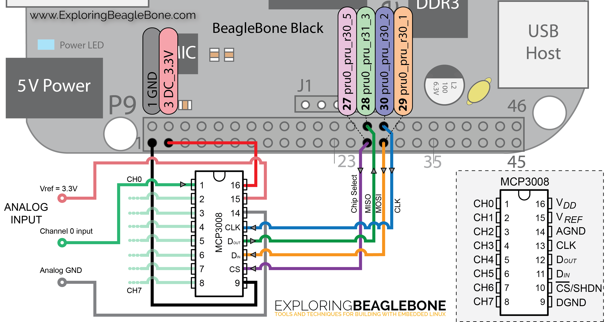

This folder contains code for a BeagleBone Black to take samples from a connected ADC. The code is based on [the OpenVLC platform](http://www.openvlc.org) and [chapter 13 from the book _Exploring BeagleBone_](http://exploringbeaglebone.com/chapter13/ ) by Derek Molloy, of which the code can be found on [its GitHub repository](https://github.com/derekmolloy/exploringBB/tree/master/chp13/adc ). It will use the PRUs (Programmable Realtime Units) to request a defined number of samples on a constant frequency.

All code in this folder must be executed with sudo rights, otherwise the PRU can not be used.

In the folder `luxsenz` most files are originating from an old version of the OpenVLC platform. Only the following files need to be used for taking ADC samples:
- `n`: script to set up the BeagleBone for taking samples. The number of samples that will be recorded can be adjusted in this file (defaults to 1.200.000). The script must be run twice.
- `r`: script to run the script `n` twice using a single command.

The following files are present in the folder `luxsenz/chp13`:
- `build`: a script to compile source files to executables
- `PRUADC.p`: assembly code for the first PRU to take samples from an ADC (may be replaced by `PRUADC.xxxx.p`) and store the samples in memory. Will be compiled to `PRUADC.bin`.
- `PRUADC.3008.p`: assembly code for the first PRU to take samples from an MCP3008 ADC.
- `PRUADC.3201.p`: assembly code for the first PRU to take samples from an MCP3201 ADC.
- `PRUADC.3202.p`: assembly code for the first PRU to take samples from an MCP3202 ADC.
- `PRUADC.c`: C code to let the PRU start taking samples. Adjusting the sample frequency can be done in this file. Will be compiled to `pruadc`.
- `PRUClock.p`: assembly code for the PRU to create a valid clock signal. Will be compiled to `PRUClock.bin`
- `mem2file.c`: will be compiled to `mem2file`. After `pruadc` has finished, this program can be used to dump the samples stored in memory. The number of samples should be used as an argument
- `output.dat`: a file that could be the output of storing samples with `mem2file`, using the command `./mem2file 100 > output.dat`

- `plot`: a script to use gnuplot to plot the first 2000 samples
- `EBB-PRU-ADC.dts`: a required file to enable I/O pins
- `EBB-PRU-ADC-00A0.dtbo`: a required file to enable I/O pins
- `README`: a file referring to the documentation from Derek Molloy.
- `consume.c`: will be compiled to `consume`. Can be altered and used to process samples real-time.
- `receive.c`: will be compiled to `receive`. Can be altered and used to process samples real-time.

The ADC should be connected according to the image below ([source](http://exploringbeaglebone.com/chapter13/)):

Details on how the BeagleBone can be used to record an ADC sample trace, can be found in the documentation folder, in the file `using a BeagleBone`.
